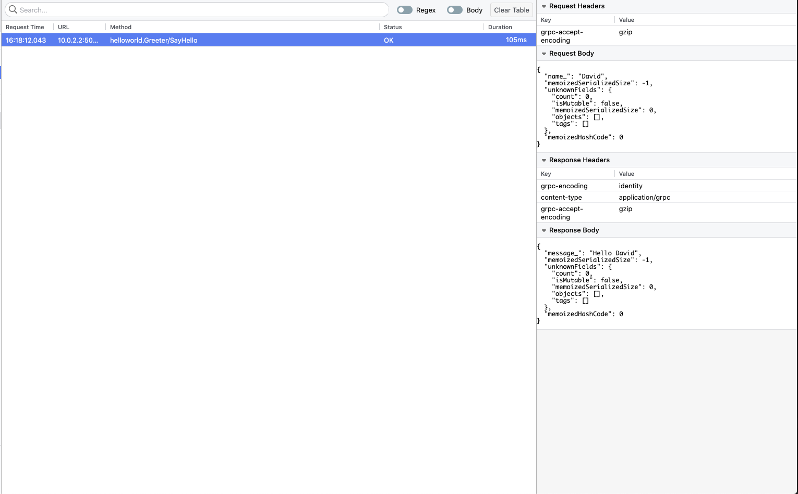

# Flipper gRPC plugin

This is a plugin for Facebook debugging tool [Flipper](https://fbflipper.com/) for logging gRPC requests from mobile clients. 

## Desktop

You need to install desktop version of the plugin to the Flipper desktop app. Open `View` > `Manage Plugins` > `Install plugins` and search for `grpc`. Once installed restart the desktop app.

## Android
[  ](https://bintray.com/ackeecz/flipper-plugin-grpc/grpc/_latestVersion)

### Gradle

```groovy
dependencies {
    ...
    implementation "cz.ackee.flipper:grpc:x.x.x"
}
```


### App

Inside your Flipper init phase add `FlipperGrpcPlugin` and keep the instance somewhere to be used later

```kotlin
class App : Application() {

    companion object {
        val flipperGrpcPlugin = FlipperGrpcPlugin()
    }

    override fun onCreate() {
        super.onCreate()
        SoLoader.init(this, false)

        val client = AndroidFlipperClient.getInstance(this)
        ...
        client.addPlugin(flipperGrpcPlugin)
        ...
    }
}
```


When creating your gRPC channel add `ClientInterceptor` provided by the plugin
```kotlin
val channel = OkHttpChannelBuilder
     ...
     .intercept(App.flipperGrpcPlugin.getInterceptor())
     .build()
``` 

and that's it. If you run your app you should now see requests in Flipper




### Sample app

If you want to run Android sample app you need either to provide your own proto files and definition of host/port
or you can use the demo `helloworld` app taken from `grpc-java` (repository)[https://github.com/grpc/grpc-java/tree/master/examples].

You need to build the `hello-world-server` app and run it on your localhost and then use emulator to run the sample app.


## iOS
Currently [gRPC Swift](https://github.com/grpc/grpc-swift) does not have a concept of interceptors and without them it's hard to provide a library
that could be easily plugged in your code. We are watching closely [this](https://github.com/grpc/grpc-swift/issues/785) issue in the repository
and once possible we will hop on that! 
  
